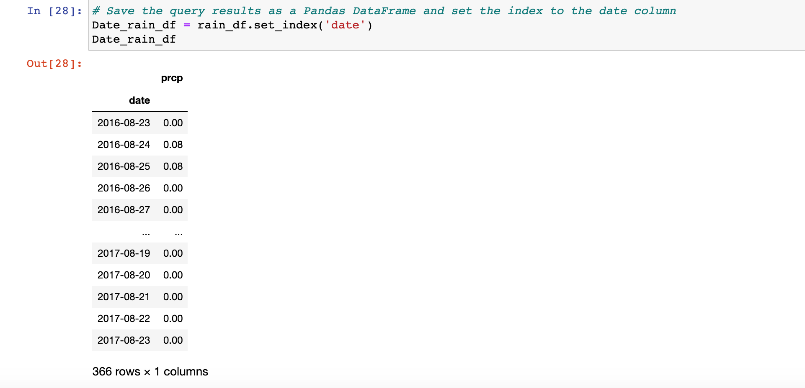
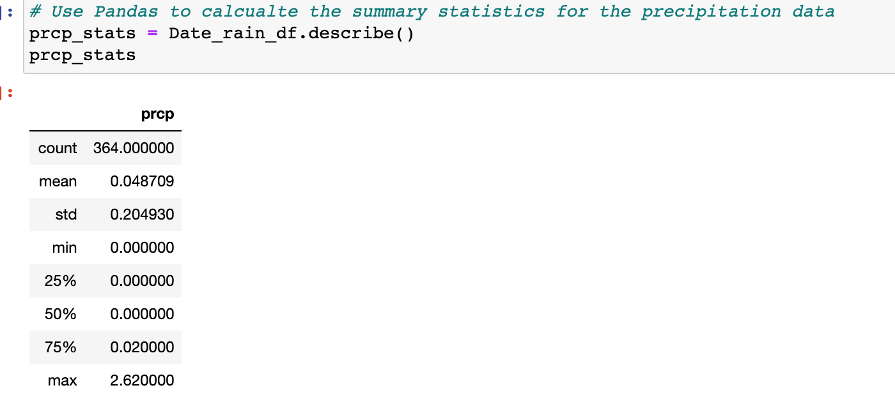
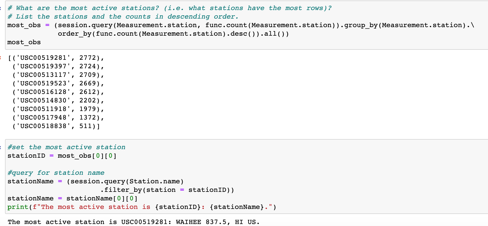
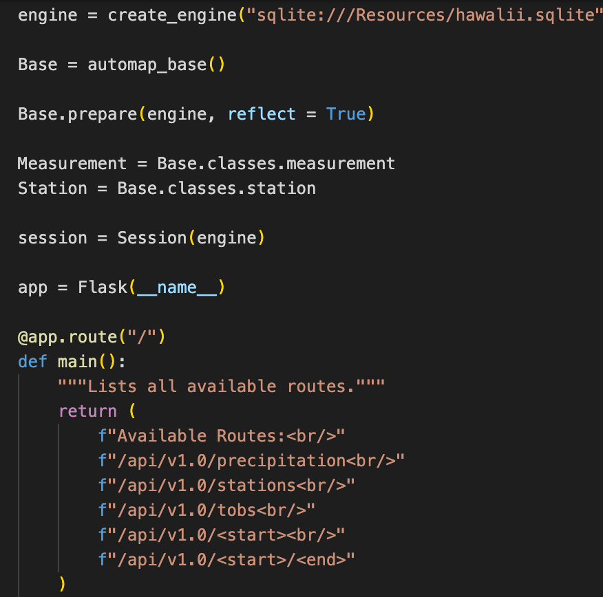

# SQLAlchemy-Challenge

**A Precipitation Analysis was performed on the provided Honolulu, Hawaii weather data.**

# **Climate Analysis and Exploration** 

Python and SQLAlchemy was used to do basic climate analysis and data exploration of the climate database. The analysis was then completed using SQLAlchemy ORM queries, Pandas, and Matplotlib.

* SQLAlchemy `create_engine` was used to connect to the sqlite database. 

* SQLAlchemy `automap_base()` was used to reflect the tables into classes and a reference was saved to those classes called `Station` and `Measurement`.

# **Precipitation Analysis**

* A query was designed to retrieve the last 12 months of precipitation data.

* Only the `date` and `prcp` values were selected.

* The query results were loaded into a Pandas DataFrame and the index was set to the `date` column.

* The DataFrame values were sorted by `date`.

* The results were plotted using the DataFrame plot method.

* Pandas was used to print the summary statistics for the precipitation data.

# **Station Analysis**

* A query was designed to calculate the total number of stations.

* A query was designed to find the most active stations.

    * The stations and observation counts were listed in descending order.

    * The station with the highest number of observations was found. 

* A query was designed to retrieve the last 12 months of temperature observation data (TOBS).

  * The stations were filtered by the the highest number of observations.

  * The results were ploted as a histogram.

# Routes

* `/`

  * Home page.

  * All routes that are available were listed.

* `/api/v1.0/precipitation`

  * The query results were converted to a dictionary using `date` as the key and `prcp` as the value.

  * The JSON representation of your dictionary was returned.

* `/api/v1.0/stations`

  * A JSON list of stations was returned from the dataset.

* `/api/v1.0/tobs`
  * The dates and temperature observations of the most active station for the last year of data were queried .
  
  * A JSON list of temperature observations (TOBS) for the previous year was returned.

* `/api/v1.0/<start>` and `/api/v1.0/<start>/<end>`

  * Return a JSON list of the minimum temperature, the average temperature, and the max temperature for a given start or start-end range.

  * When given the start only, calculate `TMIN`, `TAVG`, and `TMAX` for all dates greater than and equal to the start date.

  * When given the start and the end date, calculate the `TMIN`, `TAVG`, and `TMAX` for dates between the start and end date inclusive.